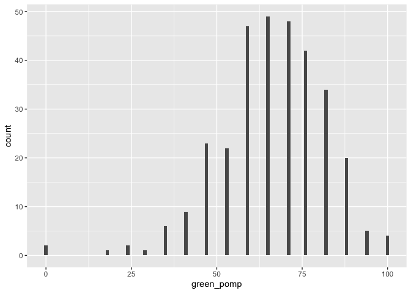
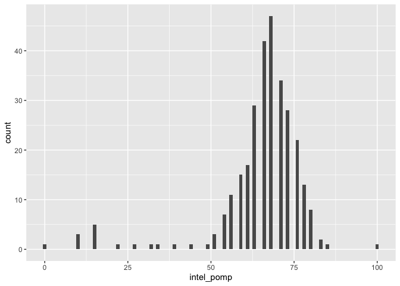
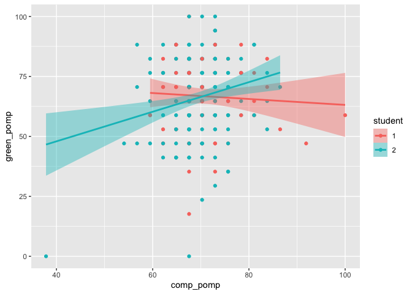
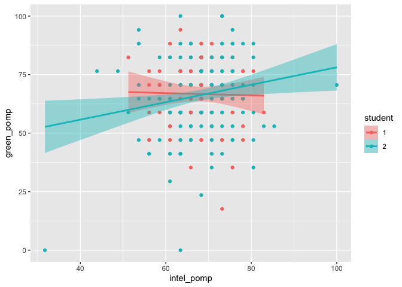
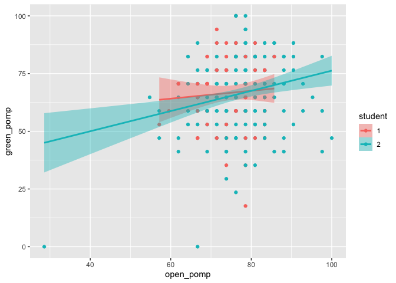
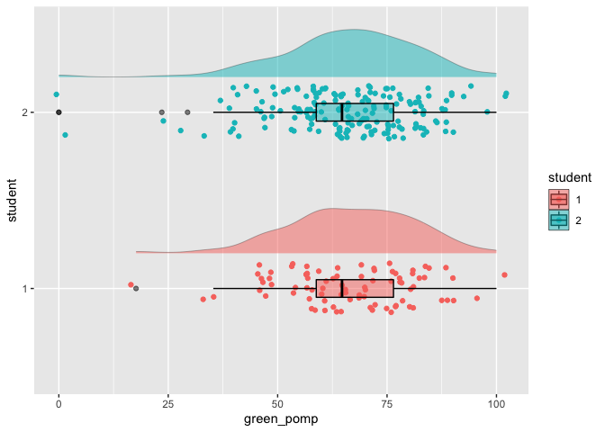

hw03
================
Naidan Tu
2/22/2021

# Homework 03

You will analyze data looking at the relationship between **green
reputation** and three personality traits–**compassion**, **intellectual
curiosity**, and **openness to experiences**. The dataset includes data
from **students** and **non-students**.

``` r
dictionary <- readr::read_csv("green_dictionary.csv")
```

    ## 
    ## ── Column specification ────────────────────────────────────────────────────────
    ## cols(
    ##   Item = col_character(),
    ##   Content = col_character(),
    ##   Options = col_character(),
    ##   Keying = col_double()
    ## )

``` r
green_data <- readr::read_csv("green_data.csv")
```

    ## 
    ## ── Column specification ────────────────────────────────────────────────────────
    ## cols(
    ##   .default = col_double(),
    ##   id = col_character()
    ## )
    ## ℹ Use `spec()` for the full column specifications.

For your assignment, do the following.

1.  Inspect the item responses (e.g., with graphs or by summarizing
    distinct values). Is anything unusual?

``` r
as_tibble(green_data)
```

    ## # A tibble: 373 x 37
    ##    id    green1 green2 green3 green4 green5 comp1 comp2 comp3 comp4 comp5 comp6
    ##    <chr>  <dbl>  <dbl>  <dbl>  <dbl>  <dbl> <dbl> <dbl> <dbl> <dbl> <dbl> <dbl>
    ##  1 9099       4      2      5      4      3     2     5     4     4     2     2
    ##  2 6275       3      5      3      3      1     4     5     4     5     5     1
    ##  3 8116       4      2      5      4      3     4     5     5     4     5     1
    ##  4 8586       4      3      5      4      3     4     5     5     4     5     1
    ##  5 0406       3      2      4      4      4     4     4     4     4     4     2
    ##  6 5645       4      3      4      4      3     5     5     5     4     4     2
    ##  7 3788       1      1      1      1      1     3     3     3     3     3     3
    ##  8 8424       4      3      2      2      2     1     1     1     2     2     4
    ##  9 8450       4      2      3      5      2     4     4     4     4     4     1
    ## 10 0512       4      2      5      5      4     5     2     5     4     2     2
    ## # … with 363 more rows, and 25 more variables: comp7 <dbl>, comp8 <dbl>,
    ## #   comp9 <dbl>, comp10 <dbl>, intel1 <dbl>, intel2 <dbl>, intel3 <dbl>,
    ## #   intel4 <dbl>, intel5 <dbl>, intel6 <dbl>, intel7 <dbl>, intel8 <dbl>,
    ## #   intel9 <dbl>, intel10 <dbl>, open1 <dbl>, open2 <dbl>, open3 <dbl>,
    ## #   open4 <dbl>, open5 <dbl>, open6 <dbl>, open7 <dbl>, open8 <dbl>,
    ## #   open9 <dbl>, open10 <dbl>, student <dbl>

``` r
green_data %>% 
  summarize(across(c(green1:student), list(mean= ~ mean(.x, na.rm=T), sd= ~sd(.x, na.rm = T), 
                                      min= ~min(.x, na.rm = T), max= ~max(.x, na.rm = T))))
```

    ## # A tibble: 1 x 144
    ##   green1_mean green1_sd green1_min green1_max green2_mean green2_sd green2_min
    ##         <dbl>     <dbl>      <dbl>      <dbl>       <dbl>     <dbl>      <dbl>
    ## 1        3.48     0.834          1          5        2.93     0.955          1
    ## # … with 137 more variables: green2_max <dbl>, green3_mean <dbl>,
    ## #   green3_sd <dbl>, green3_min <dbl>, green3_max <dbl>, green4_mean <dbl>,
    ## #   green4_sd <dbl>, green4_min <dbl>, green4_max <dbl>, green5_mean <dbl>,
    ## #   green5_sd <dbl>, green5_min <dbl>, green5_max <dbl>, comp1_mean <dbl>,
    ## #   comp1_sd <dbl>, comp1_min <dbl>, comp1_max <dbl>, comp2_mean <dbl>,
    ## #   comp2_sd <dbl>, comp2_min <dbl>, comp2_max <dbl>, comp3_mean <dbl>,
    ## #   comp3_sd <dbl>, comp3_min <dbl>, comp3_max <dbl>, comp4_mean <dbl>,
    ## #   comp4_sd <dbl>, comp4_min <dbl>, comp4_max <dbl>, comp5_mean <dbl>,
    ## #   comp5_sd <dbl>, comp5_min <dbl>, comp5_max <dbl>, comp6_mean <dbl>,
    ## #   comp6_sd <dbl>, comp6_min <dbl>, comp6_max <dbl>, comp7_mean <dbl>,
    ## #   comp7_sd <dbl>, comp7_min <dbl>, comp7_max <dbl>, comp8_mean <dbl>,
    ## #   comp8_sd <dbl>, comp8_min <dbl>, comp8_max <dbl>, comp9_mean <dbl>,
    ## #   comp9_sd <dbl>, comp9_min <dbl>, comp9_max <dbl>, comp10_mean <dbl>,
    ## #   comp10_sd <dbl>, comp10_min <dbl>, comp10_max <dbl>, intel1_mean <dbl>,
    ## #   intel1_sd <dbl>, intel1_min <dbl>, intel1_max <dbl>, intel2_mean <dbl>,
    ## #   intel2_sd <dbl>, intel2_min <dbl>, intel2_max <dbl>, intel3_mean <dbl>,
    ## #   intel3_sd <dbl>, intel3_min <dbl>, intel3_max <dbl>, intel4_mean <dbl>,
    ## #   intel4_sd <dbl>, intel4_min <dbl>, intel4_max <dbl>, intel5_mean <dbl>,
    ## #   intel5_sd <dbl>, intel5_min <dbl>, intel5_max <dbl>, intel6_mean <dbl>,
    ## #   intel6_sd <dbl>, intel6_min <dbl>, intel6_max <dbl>, intel7_mean <dbl>,
    ## #   intel7_sd <dbl>, intel7_min <dbl>, intel7_max <dbl>, intel8_mean <dbl>,
    ## #   intel8_sd <dbl>, intel8_min <dbl>, intel8_max <dbl>, intel9_mean <dbl>,
    ## #   intel9_sd <dbl>, intel9_min <dbl>, intel9_max <dbl>, intel10_mean <dbl>,
    ## #   intel10_sd <dbl>, intel10_min <dbl>, intel10_max <dbl>, open1_mean <dbl>,
    ## #   open1_sd <dbl>, open1_min <dbl>, open1_max <dbl>, open2_mean <dbl>,
    ## #   open2_sd <dbl>, open2_min <dbl>, …

There are some -99 values that need to be recoded into NA.

``` r
green_data[green_data == -99] <- NA

green_data %>% 
  summarize(across(c(green1:student), list(mean= ~ mean(.x, na.rm=T), sd= ~sd(.x, na.rm = T), 
                                      min= ~min(.x, na.rm = T), max= ~max(.x, na.rm = T))))
```

    ## # A tibble: 1 x 144
    ##   green1_mean green1_sd green1_min green1_max green2_mean green2_sd green2_min
    ##         <dbl>     <dbl>      <dbl>      <dbl>       <dbl>     <dbl>      <dbl>
    ## 1        3.48     0.834          1          5        2.93     0.955          1
    ## # … with 137 more variables: green2_max <dbl>, green3_mean <dbl>,
    ## #   green3_sd <dbl>, green3_min <dbl>, green3_max <dbl>, green4_mean <dbl>,
    ## #   green4_sd <dbl>, green4_min <dbl>, green4_max <dbl>, green5_mean <dbl>,
    ## #   green5_sd <dbl>, green5_min <dbl>, green5_max <dbl>, comp1_mean <dbl>,
    ## #   comp1_sd <dbl>, comp1_min <dbl>, comp1_max <dbl>, comp2_mean <dbl>,
    ## #   comp2_sd <dbl>, comp2_min <dbl>, comp2_max <dbl>, comp3_mean <dbl>,
    ## #   comp3_sd <dbl>, comp3_min <dbl>, comp3_max <dbl>, comp4_mean <dbl>,
    ## #   comp4_sd <dbl>, comp4_min <dbl>, comp4_max <dbl>, comp5_mean <dbl>,
    ## #   comp5_sd <dbl>, comp5_min <dbl>, comp5_max <dbl>, comp6_mean <dbl>,
    ## #   comp6_sd <dbl>, comp6_min <dbl>, comp6_max <dbl>, comp7_mean <dbl>,
    ## #   comp7_sd <dbl>, comp7_min <dbl>, comp7_max <dbl>, comp8_mean <dbl>,
    ## #   comp8_sd <dbl>, comp8_min <dbl>, comp8_max <dbl>, comp9_mean <dbl>,
    ## #   comp9_sd <dbl>, comp9_min <dbl>, comp9_max <dbl>, comp10_mean <dbl>,
    ## #   comp10_sd <dbl>, comp10_min <dbl>, comp10_max <dbl>, intel1_mean <dbl>,
    ## #   intel1_sd <dbl>, intel1_min <dbl>, intel1_max <dbl>, intel2_mean <dbl>,
    ## #   intel2_sd <dbl>, intel2_min <dbl>, intel2_max <dbl>, intel3_mean <dbl>,
    ## #   intel3_sd <dbl>, intel3_min <dbl>, intel3_max <dbl>, intel4_mean <dbl>,
    ## #   intel4_sd <dbl>, intel4_min <dbl>, intel4_max <dbl>, intel5_mean <dbl>,
    ## #   intel5_sd <dbl>, intel5_min <dbl>, intel5_max <dbl>, intel6_mean <dbl>,
    ## #   intel6_sd <dbl>, intel6_min <dbl>, intel6_max <dbl>, intel7_mean <dbl>,
    ## #   intel7_sd <dbl>, intel7_min <dbl>, intel7_max <dbl>, intel8_mean <dbl>,
    ## #   intel8_sd <dbl>, intel8_min <dbl>, intel8_max <dbl>, intel9_mean <dbl>,
    ## #   intel9_sd <dbl>, intel9_min <dbl>, intel9_max <dbl>, intel10_mean <dbl>,
    ## #   intel10_sd <dbl>, intel10_min <dbl>, intel10_max <dbl>, open1_mean <dbl>,
    ## #   open1_sd <dbl>, open1_min <dbl>, open1_max <dbl>, open2_mean <dbl>,
    ## #   open2_sd <dbl>, open2_min <dbl>, …

1.  Compute total scores for the four scales. Recode variables as
    needed.

``` r
reverse <- dictionary %>%
  filter(Keying == -1 | Keying == -2) %>%
  pull(Item)
reverse
```

    ##  [1] "green2"  "comp6"   "comp7"   "comp8"   "comp9"   "comp10"  "intel7" 
    ##  [8] "intel8"  "intel9"  "intel10" "open7"   "open8"   "open9"   "open10"

``` r
green_data %>%
  mutate(
    across(all_of(reverse),
           ~ recode(.x, "5" = 1, "4" = 2, "3" = 3, "2" = 4, "1" = 5))
  )
```

    ## # A tibble: 373 x 37
    ##    id    green1 green2 green3 green4 green5 comp1 comp2 comp3 comp4 comp5 comp6
    ##    <chr>  <dbl>  <dbl>  <dbl>  <dbl>  <dbl> <dbl> <dbl> <dbl> <dbl> <dbl> <dbl>
    ##  1 9099       4      4      5      4      3     2     5     4     4     2     4
    ##  2 6275       3      1      3      3      1     4     5     4     5     5     5
    ##  3 8116       4      4      5      4      3     4     5     5     4     5     5
    ##  4 8586       4      3      5      4      3     4     5     5     4     5     5
    ##  5 0406       3      4      4      4      4     4     4     4     4     4     4
    ##  6 5645       4      3      4      4      3     5     5     5     4     4     4
    ##  7 3788       1      5      1      1      1     3     3     3     3     3     3
    ##  8 8424       4      3      2      2      2     1     1     1     2     2     2
    ##  9 8450       4      4      3      5      2     4     4     4     4     4     5
    ## 10 0512       4      4      5      5      4     5     2     5     4     2     4
    ## # … with 363 more rows, and 25 more variables: comp7 <dbl>, comp8 <dbl>,
    ## #   comp9 <dbl>, comp10 <dbl>, intel1 <dbl>, intel2 <dbl>, intel3 <dbl>,
    ## #   intel4 <dbl>, intel5 <dbl>, intel6 <dbl>, intel7 <dbl>, intel8 <dbl>,
    ## #   intel9 <dbl>, intel10 <dbl>, open1 <dbl>, open2 <dbl>, open3 <dbl>,
    ## #   open4 <dbl>, open5 <dbl>, open6 <dbl>, open7 <dbl>, open8 <dbl>,
    ## #   open9 <dbl>, open10 <dbl>, student <dbl>

``` r
green_data <- green_data %>% 
  rowwise() %>% 
  mutate(green=sum(c_across(green1:green5), na.rm = T),
         comp=sum(c_across(comp1:comp10), na.rm = T),
         intel=sum(c_across(intel1:intel10), na.rm = T),
         open=sum(c_across(open1:open10), na.rm = T)) 

green_data[green_data == 0] <- NA
```

1.  Rescale the variables so that they go from 0-100 instead of the
    original range. Name the recaled variables `*_pomp`.

``` r
green_pomp=((green_data$green-min(green_data$green, na.rm = T))/(max(green_data$green, na.rm = T)-min(green_data$green, na.rm = T)))*100
comp_pomp=((green_data$comp-min(green_data$comp, na.rm = T))/(max(green_data$comp, na.rm = T)-min(green_data$comp, na.rm = T)))*100
intel_pomp=((green_data$intel-min(green_data$intel, na.rm = T))/(max(green_data$intel, na.rm = T)-min(green_data$intel, na.rm = T)))*100
open_pomp=((green_data$open-min(green_data$open, na.rm = T))/(max(green_data$open, na.rm = T)-min(green_data$open, na.rm = T)))*100
green_data1 <- cbind(green_data, green_pomp, comp_pomp, intel_pomp, open_pomp)
```

1.  Make plots that illustrate the distributions of the 4 POMP-scored
    variables.

    The plots show that the four variables are normally distributed.

``` r
ggplot(green_data1) +
  aes(x = green_pomp) +
  geom_histogram(binwidth = 1)
```

    ## Warning: Removed 58 rows containing non-finite values (stat_bin).

<!-- -->

``` r
ggplot(green_data1) +
  aes(x = comp_pomp) +
  geom_histogram(binwidth = 1)
```

    ## Warning: Removed 77 rows containing non-finite values (stat_bin).

<!-- -->

``` r
ggplot(green_data1) +
  aes(x = intel_pomp) +
  geom_histogram(binwidth = 1)
```

    ## Warning: Removed 77 rows containing non-finite values (stat_bin).

<!-- -->

``` r
ggplot(green_data1) +
  aes(x = open_pomp) +
  geom_histogram(binwidth = 1)
```

    ## Warning: Removed 77 rows containing non-finite values (stat_bin).

<!-- -->

1.  Make scatterplots showing the relationships between **green
    reputation** and each personality trait. Include trend lines for
    **students** and **non-students**. What do these plots show?

    The plots show that the linear relationships between green
    reputation and each personality trait are different between students
    group and non-students group.

``` r
green_data1$student <- as.factor(green_data1$student)

ggplot(na.omit(green_data1)) +
  aes(x = comp_pomp,
      y = green_pomp,
      fill = student,
      color = student) +
  geom_point() +
  geom_smooth(method = "lm", aes(group=student)) 
```

    ## `geom_smooth()` using formula 'y ~ x'

<!-- -->

``` r
ggplot(na.omit(green_data1)) +
  aes(x = intel_pomp,
      y = green_pomp,
      fill = student,
      color = student) +
  geom_point() +
  geom_smooth(method = "lm", aes(group=student)) 
```

    ## `geom_smooth()` using formula 'y ~ x'

<!-- -->

``` r
ggplot(na.omit(green_data1)) +
  aes(x = open_pomp,
      y = green_pomp,
      fill = student,
      color = student) +
  geom_point() +
  geom_smooth(method = "lm", aes(group=student)) 
```

    ## `geom_smooth()` using formula 'y ~ x'

<!-- -->

1.  Compare **green reputation** for students and non-students using a
    **rainfall plot** (bar + density + data points).

The green reputation score distributions are similar between the two
groups. The range and the median of the green reputation score are also
similar. Student group probably has more people than student group.

``` r
ggplot(na.omit(green_data1)) +
  aes(y = student,
      x = green_pomp,
      fill = student,
      color = student) +
  geom_jitter(height = .15) +
  geom_boxplot(color = "black",
               alpha = .5,
               width = .1,
               size = .5) +
  ggdist::stat_slab(height = .3,
                    color = "black",
                    size = .2,
                    alpha = .5,
                    position = position_nudge(y = .2))
```

<!-- -->

1.  Compute a summary table of means, SDs, medians, minima, and maxima
    for the four total scores for students and non-students.

For green reputation scores, student group has slightly lower mean
scores and more variations within group. For compassion scores, student
group has slightly lower mean scores and less variations within group.
For intellectual curiosity scores, student group has higher mean scores
and less variations within group. For openness to experiences scores,
student group has higher mean scores and more variations within group.

``` r
green_data1 %>% 
  filter(!is.na(student)) %>% 
    group_by(student) %>%
    summarize(across(c(green_pomp:open_pomp), list(mean= ~ mean(.x, na.rm=T), sd= ~sd(.x, na.rm = T), 
                                      median= ~median(.x, na.rm = T), min= ~min(.x, na.rm = T), max= ~max(.x, na.rm = T))))
```

    ## # A tibble: 2 x 21
    ##   student green_pomp_mean green_pomp_sd green_pomp_medi… green_pomp_min
    ## * <fct>             <dbl>         <dbl>            <dbl>          <dbl>
    ## 1 1                  66.8          14.2             70.6           17.6
    ## 2 2                  65.9          15.8             64.7            0  
    ## # … with 16 more variables: green_pomp_max <dbl>, comp_pomp_mean <dbl>,
    ## #   comp_pomp_sd <dbl>, comp_pomp_median <dbl>, comp_pomp_min <dbl>,
    ## #   comp_pomp_max <dbl>, intel_pomp_mean <dbl>, intel_pomp_sd <dbl>,
    ## #   intel_pomp_median <dbl>, intel_pomp_min <dbl>, intel_pomp_max <dbl>,
    ## #   open_pomp_mean <dbl>, open_pomp_sd <dbl>, open_pomp_median <dbl>,
    ## #   open_pomp_min <dbl>, open_pomp_max <dbl>

In your assignment, prepare an RMarkdown file that includes both the
coding and (for 4-7) narrative descriptions of your results.
